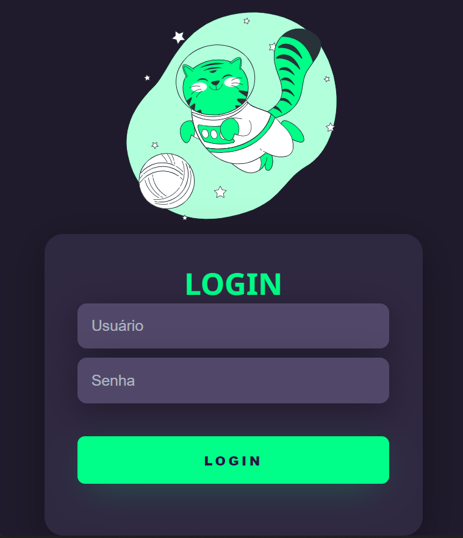

# formulario-dark
 Tela de Login responsiva simples com HTML e CSS.  
 O tutorial de como fazer está no canal do Markzuel no YouTube <a href = "https://www.youtube.com/watch?v=69-WfrVBli8">clique aqui</a>.
 

  
 

  

  
 

 
   
 
 

  
 

 
